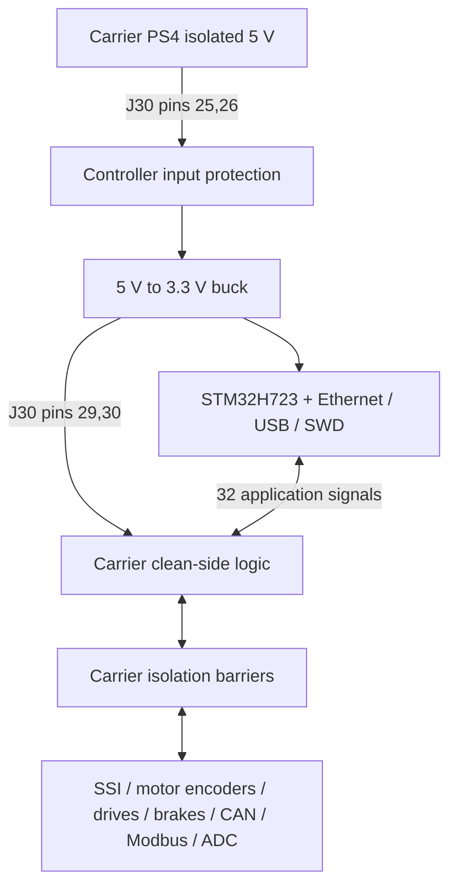

# P4.1 controller / elevation integration review

2026-10-03. Schematic review revision, with synchronized unrouted PCB drafts.
See [assembly dimensions](../assembly/README.md) and the complete
[interface pinout](../assembly/stack_pinout.csv).

## Architecture

Two KiCad projects share one repository and a versioned interface. This keeps
separate PCB netlists, fabrication outputs and reference-designator namespaces.
For example, controller U101 is the input eFuse; carrier U101 is the six-channel
encoder isolator. Every reference in review discussions must identify the board.

The controller replaces the Nucleo. It carries the MCU, Ethernet, USB, debug,
reset/clock support, watchdog, indicators and 3.3 V converter. The carrier keeps
all field wiring, isolation, converters and brake/drive/encoder/CAN/Modbus/ADC functions.
Moving field interfaces to the controller would bring field ground and multiple
supply domains through the stack; this revision keeps those boundaries on the carrier.

Both boards share the isolated logic ground. GND_BRAKE and -BATT stay separate
from that ground, as in P3. The nine field sheets are byte-identical to P3.
P4.1 adds a tenth field sheet for isolated pivot Modbus RTU / RS-485;
see [the circuit and cable details](PIVOT_MODBUS.md). J31-13/14/18 now carry
TX/RX/DE instead of ground. Both boards must use P4.1; geometry is unchanged.

## Retained and removed controller functions

| Retained | Purpose |
|---|---|
| STM32H723ZGT6, decoupling, VCAP and reset/boot | Application processor and reliable startup |
| 8 MHz crystal; optional 32.768 kHz crystal | Core clock; optional RTC |
| LAN8742A, RMII resistors, supervisor and MagJack | Ethernet connection |
| USB-C, ESD protection, VBUS divider | USB device / DFU; sense-only VBUS |
| STDC14 SWD/VCP | External debugger and serial console |
| TPS3852 and status LEDs | Independent reset supervision and firmware watchdog |
| TPS259470A + LMR33630 | Automatic-retry 5 V input protection and shared 3.3 V supply |

Removed: twenty protected ADC inputs, analog/digital expansion connectors,
three expansion load switches, the analog LDO, INA181 supply-current monitor
and TMP235 sensor. The existing carrier ADS1115 handles the actual analog work:
brake feedback plus TH1/TH2. No new ADC monitoring channels are introduced.

VDDA now uses FB201 (BLM21PG221SN1D) from the digital 3.3 V rail and 1 uF/100 nF
filter capacitors. MCU local VDDA/VREF bypassing and the VREF series resistor
remain. ST permits deriving VDDA from VDD with appropriate filtering and local
decoupling; unused analog channels do not justify a separate exported analog rail.
See [ST AN5419](https://www.st.com/resource/en/application_note/an5419-getting-started-with-stm32h723733-stm32h725735-and-stm32h730-mcu-hardware-development-stmicroelectronics.pdf).

## Power and recovery

PS4 is the retained isolated 5 V / 2 A carrier converter. Both 5 V contacts are
parallel, as are both 3.3 V contacts. The controller's TPS259470A supplies the
LMR33630; the resulting 3.3 V also powers the clean side of carrier isolators.
USB VBUS is never tied to this 5 V rail. No separately powered logic domain is
introduced across the signal interface.

R104 changes from 1.33 kohm to 2.21 kohm. Using TI's 3334/RILM relationship gives
1.51 A nominal limiting. Allowing 10% IC and 1% resistor tolerance gives roughly
1.35-1.68 A, below PS4's nominal 2 A capacity. The TPS259470A automatically retries
after faults. Its current-limit node is not connected to an ADC. Details:
[TI TPS25947 datasheet](https://www.ti.com/lit/ds/symlink/tps25947.pdf),
[RECOM REC10K-AW](https://recom-power.com/pdf/Econoline/REC10K-AW.pdf).

An initial **allocation**, not a measured worst-case specification, is 0.40 A
for MCU activity, 0.15 A for Ethernet, 0.10 A for carrier clean-side logic and
0.05 A for support circuitry: 0.70 A at 3.3 V. At an assumed 85% conversion
efficiency this is about 0.54 A from 5 V; 25% headroom gives about 0.68 A.
Finalize this with operating modes, datasheet maxima, temperature and measured
startup. The 3 A buck rating does not mean PS4 can supply 3 A at 5 V.

Reset defaults remain in the field circuits: drive disable and CAN silent
default high, brake release and STEP default low. Hardware biasing is retained.
Bench-test reset, supply ramps, unplugged controller behavior and watchdog faults.
An active overload may still make upstream PS4 limit or cycle before the eFuse
settles; automatic retry is not proof of coordinated protection.

## Pin allocation and firmware

All 32 application GPIOs cross the stack once. The CSV includes the package pad
number and intended function, with separate Port and Star columns on the drawing.

| Function | MCU allocation | Firmware consequence |
|---|---|---|
| Port quadrature A/B | PA5 / PB3, TIM2 CH1/2 AF1 | 32-bit encoder timer; PB3 SWO disabled |
| Star quadrature A/B | PC6 / PC7, TIM3 CH1/2 AF2 | 16-bit timer; handle counter wrap |
| Port / Star Z | PE4 / PE3 | Independent EXTI4 / EXTI3 |
| Port STEP | PE9, TIM1 CH1 AF1 | Preserve output role |
| Star STEP | PA0, TIM5 CH1 AF2 | TIM2 is reserved for Port quadrature |
| SSI clocks | PB10 / PE2 | Existing software-generated SSI timing |
| SSI data | PC2_C / PE5 | Close the PC2 analog switch for digital PC2 input |
| ADS1115 I2C | PB8 / PB9, I2C1 AF4 | Preserve carrier pull-ups and isolation |
| CAN | PD1 TX / PD0 RX, FDCAN1 AF9 | PE7 controls silent mode |
| Pivot Modbus RTU | PD5 TX / PD6 RX / PD4 DE, USART2 AF7 | Active-high hardware DE; match servo serial settings |
| Debug console | PD8 / PD9 | UART via STDC14 |
| Status LEDs | PB0 / PE1 / PB14 | Green / orange / red |

Package pins and alternate functions were checked against the
[STM32H723 datasheet](https://www.st.com/resource/en/datasheet/stm32h723zg.pdf).
MCU clock initialization must use an 8 MHz crystal rather than a Nucleo ST-LINK
clock assumption. SWO is disconnected at STDC14 pin 8; SWDIO, SWCLK, reset and
VCP remain. Firmware is unchanged in this hardware revision.

## Verification and limits

`python tools/validate_stack.py` regenerates ERC and XML exports and checks:

- Zero ERC findings and zero exclusions on each schematic.
- All 50 contacts, their rail aliases and the 32 MCU signal assignments.
- 144 explicitly connected/NC MCU pins and 27 preserved internal MCU connections.
- Every retained carrier component value/footprint and 191 retained net groups,
  including detection of accidental net splits or merges.
- Nine field-sheet hashes against the P3 snapshot.
- 166 controller and 337 carrier footprints against the schematic netlists.
- Pre-Modbus connectivity preserved (196 controller and 192 carrier net groups,
  excluding the explicitly reassigned J31 and MCU pins).
- Modbus TX/RX/DE, reset biases, RS-485 polarity, power domains and DE9 pinout.
- All matching pad positions, connector sides and four support clearances.

Frozen source evidence is in `docs/validation/p4_source_baselines.json`, tied to
carrier `0c9ba1f` and controller `2328ccb`. The old P3 validation entry point now
calls the P4 checker. No ERC or DRC exclusions were added to hide findings.

Both PCBs are unrouted. Controller DRC still reports inherited footprint/library
differences, 0.1875 mm fine-pitch pad gaps against a 0.2 mm rule, 0.2 mm PHY thermal
drills against a 0.3 mm rule, and silkscreen issues. Resolve footprint review and
fabricator rules during layout; these are not schematic ERC failures. New carrier
circuits are staged outside its outline. Do not generate a manufacturing release.

Actual encoder type, installed DE9 harness, maximum frequency, thermal limits,
chassis policy, vacuum cooling, vibration and full installed cable/component
clearances remain to be verified. Electrical checks and nominal mating geometry
do not establish flight qualification.
